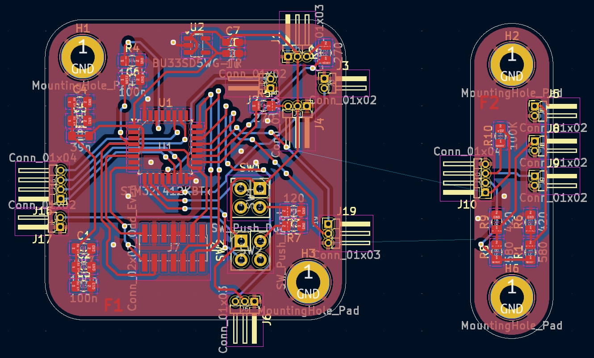

# Partie informatique

## 1. Objectif général

Cette partie du projet vise à gérer la logique de l’énigme via un microcontrôleur STM32. Le programme contrôle une LED affichant un mot en morse, lit un phototransistor pour vérifier la position d’un "codex", et commande un moteur (via PWM) permettant l’ouverture d’une boîte contenant une clé.

## 2. Configuration matérielle

Avant le développement logiciel, une configuration matérielle du microcontrôleur est nécessaire en fonction des besoins du système.

### Ressources utilisées :

#### Configuration générale

| Fonction | Broche | Configuration | Détail |
|----------------------------------|----------------------|---------------|------------------------------|
| LED morse | PA10 | GPIO_Output | Contrôle de l'affichage en morse  |
| Bouton de déclenchement | PA4 | GPIO_Input | Détection de l'appui utilisateur |
| Lecture du phototransistor | PA3 | ADC | Vérification de la résolution du codex |
| Commande du moteur | PA9 | PWM | Contrôle de l'ouverture de la boîte |

#### Configuration des composants

Il y a deux timers dans le projet. Un (tim2) pour faire fonctionner le code. Nous verrons son utilité dans la partie "Structure logicielle". Le second timer (tim1) génère le signal PWM permettant de contrôler les moteurs. 

Le timer 2 est paramétré pour généré une interruption toute les millisecondes (PSC = 3 et ARR = 9999). Ce qui est largement suffisant pour notre programme qui dépend surtout de l'interaction avec l'utilisateur.

Tandis que le timer 1 est configuré pour générer un signal PWM sur le channel 2 (PA9) pour des raisons de débogage (PA8 soit channel 1 est aussi utilisé par la carte dans le mode debug). Par défaut, le timer possède un PSC de 3 et un ARR de 19999. Et, l'auto reload preload est activé.

L'adc est simplement activé sur IN8 (PA3).

## 3. Structure logicielle

Le programme fonctionne en simulant du multithreading. Chaque milliseconde, une interruption générée par le Timer 2 qui appelle successivement l'une des **4 fonctions du projet**, de manière cyclique.

### Les tâches sont les suivantes :

- **taskReadBtn**  
   Lit l’état du bouton utilisateur et met à jour la variable globale `motor_state`.

- **taskBlinkLed**  
   Gère l’affichage du message en morse via la LED, en fonction de `morse_btn_state`.

- **taskReadLed**  
   Lit la tension aux bornes du phototransistor via l’ADC. Si la tension dépasse un seuil, cela indique que le bon mot est affiché sur le codex.

-  **taskControlMotor**  
   Modifie le signal PWM selon l’état de l’énigme (`motor_state`), avec un délai d’une seconde pour éviter les activations accidentelles.

## 4. Détails de l’implémentation

### `main.c`

Le fichier "main" n'est utilisé uniquement pour initialiser les différent composants du projet : 

- Activation des interruptions (Timer 2)
- Lancement du signal PWM (Timer 1)

### `stm32l4xx_it.c`

Ce fichier comprend le cœur des fonctions du projet, exécuté à chaque interruption du Timer 2.

#### `taskReadBtn()`

Fonction simple mais essentielle :  
Elle lit l’état du bouton poussoir et met à jour la variable `morse_btn_state`. Cette variable déclenche ou interrompt la séquence Morse dans les autres fonctions.

#### `taskBlinkLed()`

Cette fonction affiche un mot en morse via une LED.  
- Des variables statiques gèrent le caractère affiché ainsi que sa durée d'exposition.
- À chaque appel, si le bouton a été pressé (`morse_btn_state == 1`), la LED clignote selon le code Morse définie dans une constante.
- En fin de message, les variables sont réinitialisées.

#### `taskReadLed()`

Fonction de lecture analogique :
- Lance une conversion ADC et attend la fin.
- Convertit la valeur lue (sur 12 bits, 0–4095) en tension via un produit en croix : $tension = \frac{100.Valeur~de~l'adc}{2^{12}}$. Ce qui permet d'avoir une valeur comprise entre 0 et 100 en sortie. On aurait pu multiplié par 5 pour obtenir la tensions aux bornes du photo-transistor en sortie, le choix de multiplié par 100 est purement arbitraire.
- Si la tension dépasse un seuil défini (ici 90), la variable globale `motor_state` est mise à 1 (sinon 0), indiquant que le codex a été résolu.

#### `taskControlMotor()`

Cette fonction gère le moteur via la PWM :
- Si `motor_state` passe à 1, on lance un compte à rebours d'une seconde avant de modifier le signal PWM.
- Cela évite que l’utilisateur n’active le moteur par hasard lors de la rotation du codex.
- Le PWM est modifié via `__HAL_TIM_SET_COMPARE()` en fonction de l’état validé.

Le rôle des moteurs dans l'énigme étant de simplement ouvrir ou fermé le prix. Ces derniers ne se situeront qu'au deux extrêmes possibles (0 ou 180°). C'est pourquoi, avec `__HAL_TIM_SET_COMPARE()`, nous paramétrons le signal pour qu'il soit sur un des deux extrêmes, c'est-à-dire une largeur de crénau de 10ms ou de 20ms.

NB : A savoir que lorsque l'on flash le code sur le microprocesseur, il faut ensuite couper l'alimentation de la carte avant de la remettre pour que le code prenne effet.

# Concernant le PCB

## 1. Enjeux du PCB

Pour le projet, nous avons besoin de créer un PCB qui respecte certaines conditions, comme le fait que nous prévoyons d’utiliser deux faces du cube et que nous sommes dans une démarche écologique, donc sans gaspillage.
Nous allons également avoir besoin d’utiliser des composants sans forcément les relier directement au PCB.

## 2. Disposition sur le PCB

### Pour la composition du PCB, nous avons besoin de plusieurs éléments :

- **Le microprocesseur**  
   Nous avons décidé d’utiliser le `STM32L412KBT6`, car il possède suffisamment de pins pour notre projet et nous permet de rester sur la gamme STM. Il sera accompagné de son connecteur afin de pouvoir téléverser le code.\
  _Nous utiliserons un réseau de trois condensateurs, 4,7 µF, 100 nF, et 100 nF, pour découpler l’alimentation générale.
Nous filtrerons également l’alimentation à l’aide d’un filtre LC, afin de la stabiliser. Ce filtre sera composé d’une inductance de 39 nH et de deux condensateurs de 1 µF et 10 nF, dans le but de filtrer les hautes fréquences et les parasites liés à la masse._

- **Les lasers**  
   Nous aurons besoin d’une partie dédiée aux lasers et à leurs récepteurs (utilisés dans la deuxième énigme). Le but de cette énigme est d’utiliser un jeu de miroirs pour rediriger les faisceaux vers leurs récepteurs, afin de résoudre l’énigme.\
   _Les lasers utilisé sont des `VMA434` et on besoins simplement du résistance de 270 ohms sur le pin d'information._

- **Le régulateur de tension**  
   Nous avons également besoin d’un régulateur de tension pour l’alimentation du PCB, nous utilisons un LDO, le `BU33SD5WG-TR`.\
   _Nous relierons le GND et le Vout par un condensateur de 1 µF, de même pour le Vin et le GND. Le Vin sera alimenté en 5 V et le Vout délivrera du 3,3 V._

- **Une seconde PCB sera fixée sur une autre face pour le fonctionnement du codex.**  
   Elle comprendra une LED (émetteur) qui, une fois le bon code trouvé sur notre codex, viendra éclairer un phototransistor (récepteur) en passant à travers de petits trous alignés dans les roues du codex. Il y aura également une LED qui affichera le code morse afin que l’utilisateur puisse le déchiffrer.\
  _Une résistance de 10 kΩ sera utilisée pour le phototransistor, ainsi que des résistances d’adaptation pour les LED : une de 580 Ω reliée à l’alimentation, et une autre de 420 Ω reliée au GND._

- **Deux boutons**  
   Un pour réinitialiser le code morse, et un autre pour réinitialiser le microcontrôleur (et donc les lasers également).\
   _Ils seront en montage push-pull, avec des resistance de 120 Ω._

- **Deux Servomoteurs**  
   Le premier permettra l’ouverture de la trappe pour accéder à la clé après la résolution de nos énigmes.
   Le second servira à ouvrir la boîte une fois toutes les énigmes résolues.
   Il suffit qu’ils tournent à 180° pour permettre une ouverture optimale.

- **Les clefs**  
   Nous avons besoin d’un accès au 5V et au GND afin d’interconnecter les différentes clés entre elles.

- **Infos importantes**  
   Comme tous les composants ne sont pas directement connectés au PCB, car ils doivent être placés à différents endroits, nous utilisons des connecteurs à la place des composants pour faciliter leur déport.\
  Des trous de fixation sont également prévus afin de pouvoir fixer nos PCB.

 

# 3. Conception mécanique et assemblage

## 3.1 Objectif de conception

L’un des objectifs majeurs de notre projet était de rendre notre dispositif **totalement reproductible** sans nécessiter de machines industrielles. Pour cela, nous avons choisi de ne faire appel qu’à une **imprimante 3D**, aujourd’hui couramment disponible dans les établissements scolaires et chez les particuliers. Ce choix garantit une accessibilité maximale et facilite la réplicabilité du projet.

## 3.2 Outils et logiciels utilisés

La modélisation 3D a été réalisée à l’aide de **Tinkercad**, un outil simple et intuitif, parfaitement adapté pour concevoir des pièces rapidement, même sans expérience avancée en modélisation. Malgré ses limitations par rapport à des logiciels professionnels comme SolidWorks, Tinkercad s’est avéré suffisant pour notre projet.

## 3.3 Le codex

Le **codex** est le cœur de notre énigme : il est constitué de **six disques rotatifs**, chacun comportant un **trou** positionné avec précision. Lorsque les disques sont alignés sur les bonnes lettres, les trous laissent passer la lumière d’une **LED émettrice** jusqu’à un **phototransistor récepteur**.

- Le mot utilisé dans cette version du codex est **"cadena"** (sans "s", une petite omission volontairement conservée).
- Chaque disque possède **26 crans**, correspondant aux **26 lettres de l’alphabet** .

Lorsque le bon mot est aligné, la LED éclaire le phototransistor, ce qui déclenche l’ouverture de la trappe contenant la **clé**.

## 3.4 Mécanisme d’ouverture motorisé

L’ouverture de la trappe se fait via un **servomoteur**, activé dès que le codex valide la solution. Pour convertir le mouvement du servomoteur en une action mécanique fiable, nous avons conçu un **système d’engrenages** également imprimé en 3D.

Ce mécanisme permet :
- Une **transmission fiable** de l’effort moteur.
- Une **ouverture douce** de la trappe.
- Une **compatibilité mécanique totale** avec les autres composants imprimés.

Bien que nous ne disposions pas de logiciels de simulation avancés (comme SolidWorks) pour tester virtuellement ce système, nous avons pu valider son fonctionnement par des essais physiques et des ajustements progressifs.

## 3.5 Boîte en bois découpée au laser

Pour l’enceinte du projet, nous avons opté pour une **boîte en bois**, réalisée par **découpe laser**. Ce choix offre une structure rigide, écologique, et facilement personnalisable.

- Nous avons utilisé le site **MakerBox** pour générer automatiquement les plans de la boîte selon nos dimensions (ici, **30 × 30 cm**).
- Les fichiers SVG générés ont été modifiés avec **Inkscape**, un logiciel libre de dessin vectoriel, afin de répondre aux besoins spécifiques de notre groupe et des autres équipes travaillant sur le projet.

Grâce à cette approche, nous avons obtenu une boîte à la fois **fonctionnelle**, **esthétique** et **parfaitement adaptée** à notre structure interne.

